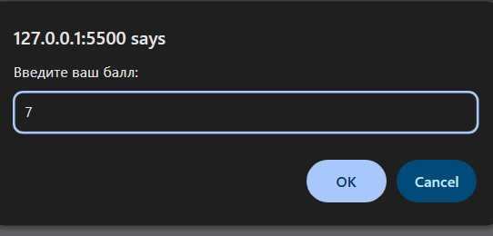
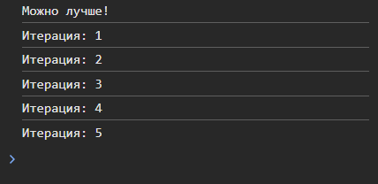
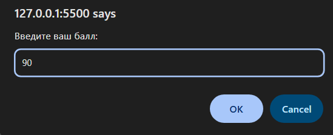
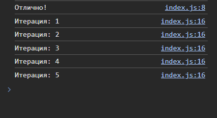

# Лабораторная работа №1: Основы JavaScript

## Цель работы
Познакомиться с основами JavaScript, научиться писать и выполнять код в браузере и в локальной среде, разобраться с базовыми конструкциями языка.

---

## Выполнение работы

### Задание 1. Выполнение кода в браузере

#### 1. Подготовка среды
* Установлен текстовый редактор **VS Code**.
* Установлена среда выполнения **Node.js**.
* Изучен интерфейс **DevTools** (вкладка Console).

#### 2. Работа в консоли браузера
В консоли разработчика выполнены базовые команды:
* `console.log("Hello, world!");` — вывод строки.
* `2 + 3` — выполнение арифметической операции (результат: `5`).


#### 3. Создание HTML-страницы с встроенным скриптом
Создан файл `index.html`. При его открытии в браузере вызывается модальное окно `alert` и выводится сообщение в консоль.

#### 4. Подключение внешнего JS-файла
Код вынесен в отдельный файл `script.js`.
```html
<head>
  <title>Привет, мир!</title>
  <script src="script.js"></script>
</head>
```
### Задание 2. Работа с типами данных и конструкциями
#### 1. В файле script.js объявлены переменные различных типов:
```html
let name = "Iulia"; // String
let birthYear = 1997;// Number
let isStudent = true;// Boolean
console.log(name, birthYear, isStudent);
```
#### 2. Управление потоком (Условия и циклы)
Реализована проверка баллов через prompt и цикл for:

Условие: Группирует результат в зависимости от введенного числа (Отлично/Хорошо/Можно лучше).

Цикл: Выводит в консоль 5 итераций.
```html
let score = prompt("Введите ваш балл:");
if (score >= 90) {
  console.log("Отлично!");
} else if (score >= 70) {
  console.log("Хорошо");
} else {
  console.log("Можно лучше!");
}

for (let i = 1; i <= 5; i++) {
  console.log(`Итерация: ${i}`);
}
```





## Контрольные вопросы

#### 1. Чем отличается var от let и const?
* var: старый способ. Имеет функциональную область видимости, подвержен "поднятию" (hoisting) и позволяет повторное объявление.

* let: современный стандарт. Имеет блочную область видимости (ограничен фигутными скобками {}).

* const: как и let, имеет блочную видимость, но не позволяет переопределять значение переменной после инициализации.
#### 2. Что такое неявное преобразование типов?
Это автоматическое приведение значений из одного типа в другой, которое JavaScript выполняет во время операций.
#### 3. Как работает оператор == в сравнении с ===?
* == (Нестрогое равенство): Сравнивает значения, предварительно пытаясь привести их к общему типу. Например, 5 == "5" вернет true.

* === (Строгое равенство): Сравнивает и значение, и тип данных. Приведение типов не происходит. Например, 5 === "5" вернет false.

## Вывод

В ходе выполнения лабораторной работы я освоила основы работы с языком **JavaScript**. Были изучены способы запуска кода как непосредственно в консоли браузера, так и через подключение внешних файлов к HTML-странице:
* **Переменными и типами данных** (строки, числа, логические значения).
* **Операторами вывода** (`console.log`, `alert`, `prompt`).
* **Управляющими конструкциями**: условиями `if/else` и циклами `for`.

Также были разобраны ключевые различия в области видимости переменных (`let` vs `var`) и особенности строгого сравнения в JS. Эти знания являются фундаментом для дальнейшего изучения веб-разработки.

---

## Библиография и ресурсы
1. **Современный учебник JavaScript** (Илья Кантор).  
   [https://learn.javascript.ru/](https://learn.javascript.ru/)
2. **Шпаргалка по Markdown** [https://github.com/sandino/Markdown-Cheatsheet/blob/master/README.md#lists](https://github.com/sandino/Markdown-Cheatsheet/blob/master/README.md#lists)
3. **Node.js Documentation** — Официальная документация среды выполнения.  
   [https://nodejs.org/docs/](https://nodejs.org/docs/)